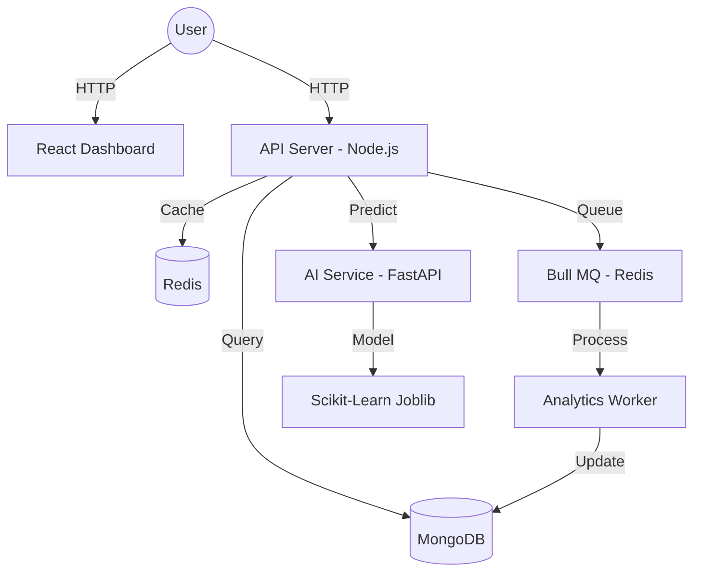

# 🚀 AI-Powered Scalable URL Shortener: Project Report

## 1. Executive Summary
This project is an advanced, production-ready URL shortening system featuring real-time AI security, high-performance redirection, and a comprehensive analytics dashboard. It is designed for scalability and robustness using a microservices architecture.

## 2. Architecture Overview
The system consists of six primary components orchestrated via Docker:

## 3. Core Features
- **🛡️ AI Malicious Detection**: Every URL is analyzed by a Scikit-Learn model before shortening to protect against phishing and malware.
- **⚡ Sub-Millisecond Redirects**: Utilizes a Redis caching layer for near-instant redirection.
- **📊 Real-Time Analytics**: Tracks clicks, IP addresses, and user-agents asynchronously using a background worker (Bull MQ).
- **🎨 Modern Dashboard**: A fully responsive UI built with Vite, React, and Tailwind CSS for managing links and viewing performance charts.
- **🛡️ Enterprise Security**: Implements Phase 3 security middleware (Helmet, Rate Limiting, NoSQL Sanitization, XSS protection).

## 4. Tech Stack
- **Frontend**: React, Vite, Tailwind CSS, Recharts, Lucide-React.
- **Backend**: Node.js, Express, Mongoose, Ioredis, Bull.
- **AI Service**: Python, FastAPI, NumPy, Pandas, Scikit-Learn.
- **Infrastructure**: Docker, Docker Compose, Redis, MongoDB.

## 5. System Health Status
As of the latest audit, all services are operational.
- **Frontend**: Operational on port 80.
- **API Server**: Operational on port 5000.
- **AI Service**: Operational on port 8000.
- **Database/Cache**: Healthy and connected.

## 6. Future Roadmap
- **User Authentication**: JWT-based login/signup for private link management.
- **Custom Aliases**: User-defined short codes.
- **Link Expiration**: Time-to-live settings for URLs.
- **QR Code Generation**: Integrated QR support for every link.
- **Advanced Geolocation**: Analytics breakdown by country and city.
