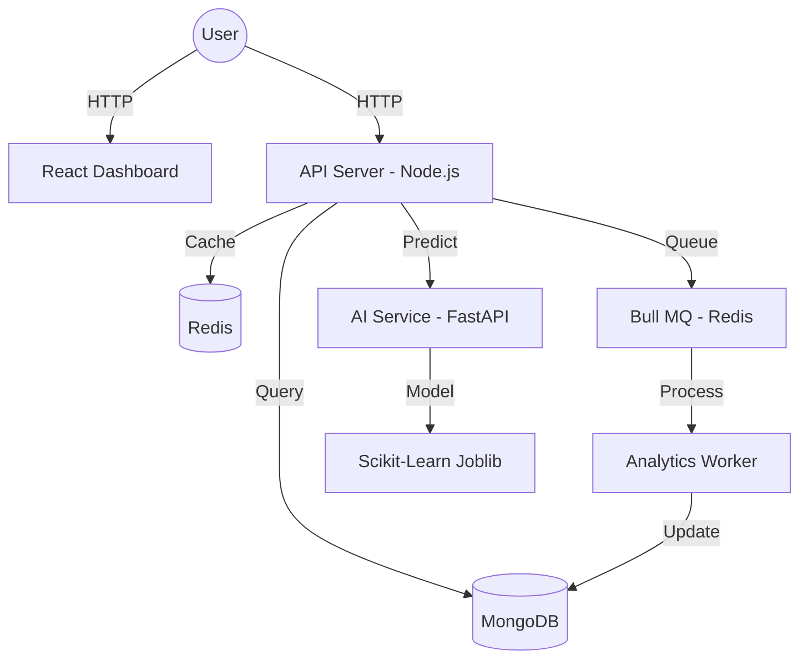

# 🚀 AI-Powered Scalable URL Shortener

An advanced, production-ready URL shortening system featuring real-time AI security detection, high-performance redirection, and a comprehensive analytics dashboard.

## 🌟 Key Features

- **🛡️ AI Malicious Detection**: Every URL is analyzed by a Scikit-Learn model before shortening to protect against phishing and malware.
- **⚡ Sub-Millisecond Redirects**: Utilizes a Redis caching layer for near-instant redirection.
- **📊 Real-Time Analytics**: Tracks clicks, IP addresses, and user-agents asynchronously using Bull MQ.
- **🎨 Modern Dashboard**: Fully responsive UI built with Vite, React, and Tailwind CSS.
- **🛡️ Enterprise Security**: Built-in security middleware including Helmet, Rate Limiting, NoSQL Sanitization, and XSS protection.
- **🐳 Containerized**: Fully orchestrated using Docker and Docker Compose for easy deployment.

## 🏗️ Architecture

The system follows a microservices architecture for scalability and fault tolerance:



## 🛠️ Tech Stack

- **Frontend**: React, Vite, Tailwind CSS, Recharts, Lucide-React.
- **Backend**: Node.js, Express, Mongoose, Ioredis, Bull.
- **AI Service**: Python, FastAPI, NumPy, Pandas, Scikit-Learn.
- **Infrastructure**: Docker, Docker Compose, Redis, MongoDB.

---

## 🚀 Getting Started

### 1. Using Docker (Recommended)

Ensure you have [Docker](https://www.docker.com/) and [Docker Compose](https://docs.docker.com/compose/) installed.

1. Clone the repository.
2. Run the orchestration command:
   ```bash
   docker-compose up --build
   ```
3. Access the services:
   - **Frontend**: `http://localhost:80`
   - **API Server**: `http://localhost:5000`
   - **AI Service**: `http://localhost:8000`

### 2. Manual Execution

If running without Docker, refer to the [RUN_MANUAL.md](RUN_MANUAL.md) for detailed environment setup and dependency installation for each service.

---

## 📈 Future Roadmap

- [ ] **User Authentication**: JWT-based login/signup for private link management.
- [ ] **Custom Aliases**: User-defined short codes.
- [ ] **Link Expiration**: Time-to-live settings for URLs.
- [ ] **QR Code Generation**: Integrated QR support for every link.
- [ ] **Advanced Geolocation**: Analytics breakdown by country and city.

## 📄 License
This project is open-source and available under the MIT License.
